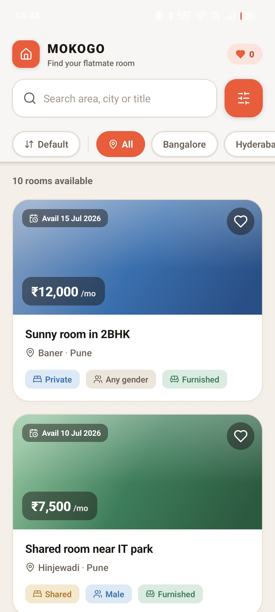
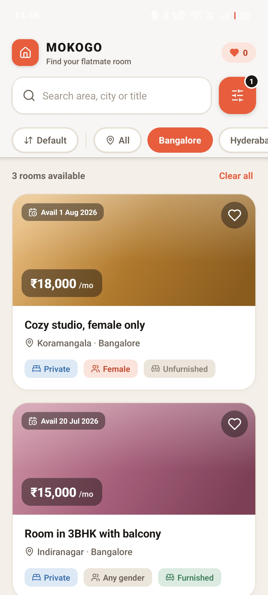
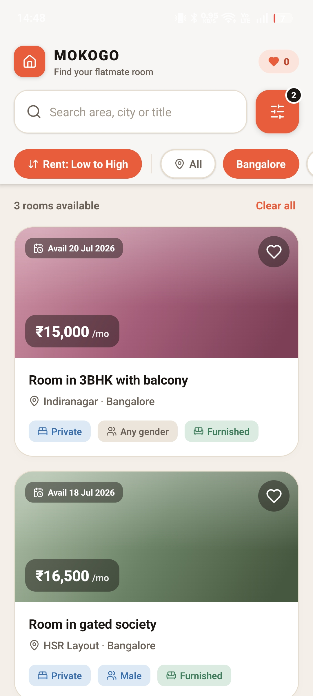
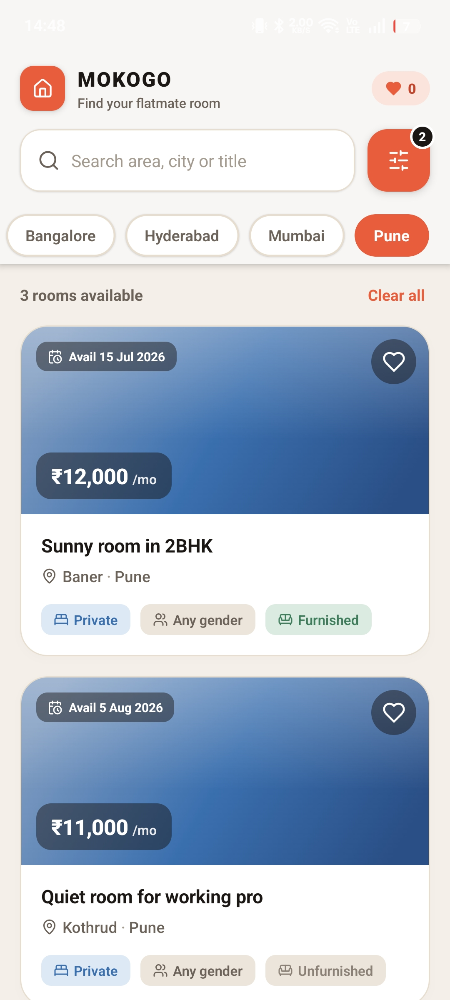
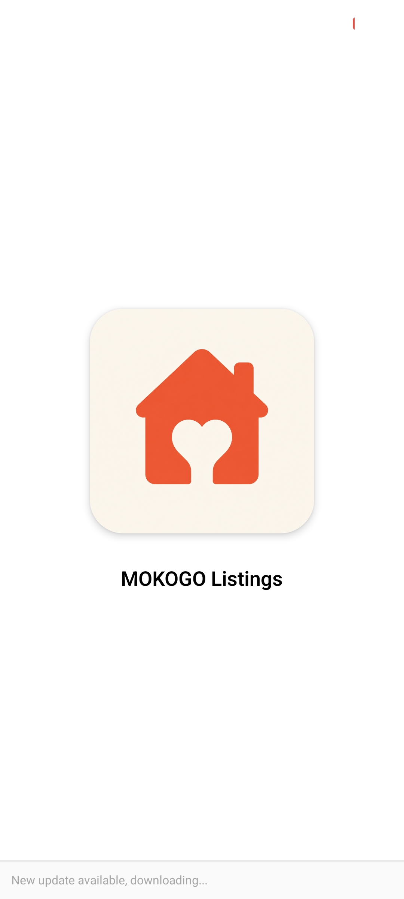

# MOKOGO – Listings Screen

<p align="center">
  
  
  
</p>
<p align="center">
  
  
</p>

A beautifully designed, single-screen React Native application built with Expo to display flatmate room listings. This project was developed as a screening task for MOKOGO, demonstrating a clean architecture, robust state management, and a highly polished user interface.

## 🚀 Features

- **Listing Cards:** A scrollable list displaying essential room details including title, locality, city, monthly rent, room type, preferred gender, furnished status, and availability.
- **Advanced Filtering:** A fully combinable bottom-sheet filtering system supporting:
  - **City** (Single-select)
  - **Preferred Gender** (Multi-select)
  - **Room Type** (Multi-select)
  - **Max Rent** (Custom draggable stepper/slider)
- **Search & Sort:** Text-based search across title, locality, and city. Real-time sorting by rent (Low to High / High to Low).
- **Responsive States:** 
  - **Loading State:** Shimmering skeleton placeholders simulating a network fetch.
  - **Empty State:** A polished "no results" state with a one-tap clear filter action.
- **Type Safety:** 100% typed with TypeScript for reliable and predictable data models.

## 📦 How to Run

Ensure you have [Node.js](https://nodejs.org/) installed. 

1. **Clone the repository** and navigate to the project folder:
   ```bash
   cd expo
   ```

2. **Install dependencies:**
   ```bash
   bun install
   ```
   *(Alternatively, you can use `npm install` or `yarn install`)*

3. **Start the Expo development server:**
   ```bash
   npx expo start
   ```
   *(If you experience local network connection issues on Expo Go, run `npx expo start --tunnel` instead).*

4. **View the App:**
   - Scan the QR code in your terminal using the **Expo Go** app on your physical device.
   - Press `i` to open in an iOS simulator, or `a` for an Android emulator.

## 🏗️ State Management Approach

The application's state is managed using a combination of local `useState` and derived `useMemo` hooks. 
- **Filtering Pipeline:** The core logic computes the `visibleListings` array by applying the search query, active filters, and sorting preferences against the static dataset. This approach is pure, highly performant, and trivial to unit test.
- **Draft State:** The filter sheet uses a local `useRef` draft state. Changes are only committed when the user presses **"Apply filters"**. This mimics standard e-commerce filter UX and prevents the list from flickering or re-rendering on every single toggle.
- **Memoization:** Components like `ListingCard` are wrapped in `React.memo` to ensure that interactions (like tapping the save icon) do not trigger unnecessary re-renders of the entire list.

While robust state management libraries like React Query or Zustand are excellent for production apps with complex backend interactions, introducing them here for a fixed 10-row local dataset would have added unnecessary boilerplate without tangible benefits.

## ⚖️ Tradeoffs & Decisions

- **Custom Rent Stepper:** Instead of using a third-party slider library (which often causes compatibility issues with Expo Go out-of-the-box), I implemented a bespoke, pan-responder-based custom slider/stepper. It provides a precise and tactile experience while keeping the project dependency-light and guaranteed to run in Expo Go.
- **In-Memory Saves:** The "heart/save" toggle state is kept in memory. In a real-world scenario, this would be persisted using `AsyncStorage` or synced with a backend API.
- **Single Route Architecture:** Per the assignment constraints, no navigation stack (like Expo Router stacks or React Navigation) was utilized, keeping the logic strictly confined to a single, easily reviewable screen.

## 🔭 What I'd Improve with More Time

Given additional time, I would focus on the following enhancements:
1. **Backend Integration:** Replace the simulated `setTimeout` fetch with real API calls using **React Query** for caching, automatic retries, and `useInfiniteQuery` for pagination.
2. **Persistence:** Use `AsyncStorage` or `SecureStore` to persist the user's saved listings and recently applied filter preferences across app launches.
3. **Rich Navigation:** Add a navigation stack to route users to a detailed "Listing View" featuring an image carousel, host details, a map view, and contact CTAs.
4. **Enhanced Animations:** Implement Reanimated for smoother shared-element transitions between the list and detail views, and more fluid bottom-sheet interactions.
5. **Testing:** Add comprehensive unit tests (using Jest) for the filtering/sorting pipeline, and integration tests (using React Native Testing Library) for the bottom sheet interactions.

---
*Developed for the MOKOGO Engineering Team.*
